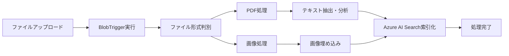
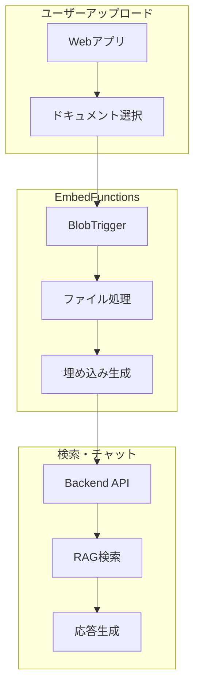

# EmbedFunctions プロジェクトの機能概要
EmbedFunctionsプロジェクトは、Azure Functions v4 (.NET 8) を使用したドキュメント自動埋め込み処理システムです。

## 🎯 主な役割
1. Blob Storage トリガーによる自動処理
  - Azure Blob Storage の content コンテナにファイルがアップロードされると自動的に起動
  - PDFファイルと画像ファイル（PNG, JPG, JPEG, GIF）に対応
2. ドキュメント埋め込み処理



## 🔧 技術スタック
Azure Functions v4 構成
- .NET 8 + Isolated Worker Model
- BlobTrigger による自動実行
- 消費型プラン (Y1) での運用

主要Azure サービス統合
- Azure AI Document Intelligence - PDFテキスト抽出・分析
- Azure AI Search - ベクトル検索インデックス作成・管理
- Azure OpenAI - 埋め込みベクトル生成
- Azure Computer Vision - 画像埋め込み (Vision機能有効時)
- Azure Blob Storage - ファイル管理

サポートするベクトルDB
```
public enum EmbeddingType
{
    AzureSearch,   // 標準
    Pinecone,      // 外部ベクトルDB
    Qdrant,        // オープンソース
    Milvus         // 分散型
}
```

## 📋 処理フロー詳細
PDFファイル処理

1.	Azure AI Document Intelligenceでテキスト・レイアウト抽出
2.	Azure OpenAIでテキストの埋め込みベクトル生成
3.	Azure AI Searchインデックスに登録
4.	corpusコンテナにテキスト保存

画像ファイル処理

1.	Azure Computer Visionで画像埋め込みベクトル生成
2.	Azure AI Searchの画像インデックスフィールドに登録
3.	contentコンテナに元画像保存

マルチ環境対応
•	Azure OpenAI / OpenAI.com の両方をサポート
•	Vision機能の有効/無効切り替え
•	環境変数による柔軟な設定

## 🎯 システム内での位置づけ



## ⚡ 特徴
- 📋 完全自動化: ファイルアップロード→処理→検索準備まで無人対応
- 🔄 スケーラブル: Azure Functions消費プランによる自動スケール
- 🎯 柔軟性: 複数のベクトルDB・AI サービスに対応
- 📊 監視: Application Insights による詳細監視
- 🔐 セキュア: Managed Identity による認証

このプロジェクトは RAG (Retrieval Augmented Generation) システムのデータ前処理パイプラインとして機能し、アップロードされたドキュメントを自動的に検索可能な形に変換する重要な役割を担っています。
