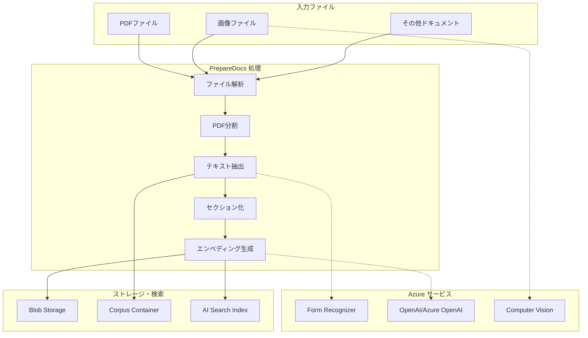
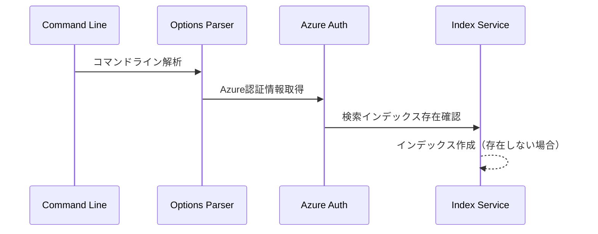
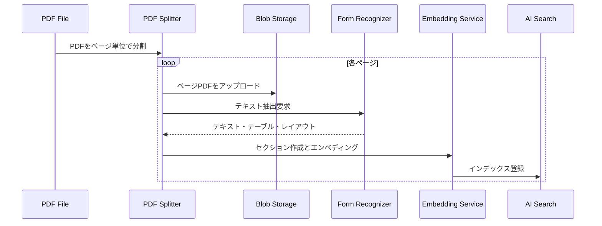
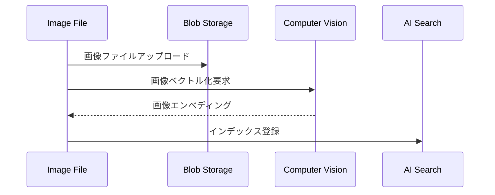

# PrepareDocs - ドキュメント前処理ツール
## 📋 概要

`PrepareDocs`は、Azure AI Search + OpenAI デモアプリケーション用のドキュメント前処理コンソールツールです。PDFファイルや画像ファイルをRAG（Retrieval-Augmented Generation）パターンで利用するために、Azure AI Searchで検索可能な形式に変換・インデックス化します。

## 🎯 主な機能

### 1. **ドキュメント処理機能**
- **PDF処理**: PDFファイルを1ページずつ分割して処理
- **画像処理**: PNG/JPG/JPEG形式の画像ファイルを処理
- **テキスト抽出**: Azure AI Document Intelligence（旧Form Recognizer）でテキストやテーブルを抽出
- **セクション分割**: 長いドキュメントを検索に適した小さなセクションに分割

### 2. **Azure統合機能**
- **Azure Blob Storage**: 処理済みファイルのアップロード
- **Azure AI Search**: ベクトルインデックスの作成と更新
- **OpenAI/Azure OpenAI**: テキストエンベディング生成
- **Computer Vision**: 画像のベクトル化（GPT-4 Vision使用時）

### 3. **管理機能**
- **ファイル削除**: 個別ファイルまたは全体の削除
- **インデックス管理**: 検索インデックスの作成・更新・削除
- **バッチ処理**: 複数ファイルの並列処理

## 🏗️ アーキテクチャ



## 🛠️ 使用方法

### 基本的なコマンド構文

```bash
dotnet run --project prepdocs/PrepareDocs/PrepareDocs.csproj [ファイルパターン] [オプション]
```

### 主要オプション

#### **必須パラメータ**
- `files` - 処理対象ファイルのパターン（例：`"./data/**/*"`）
- `--searchendpoint` - Azure AI Search サービスエンドポイント
- `--storageendpoint` - Azure Blob Storage エンドポイント
- `--container` - Blob Storage コンテナ名

#### **OpenAI設定**
- `--openaiendpoint` - Azure OpenAI エンドポイント（Azure OpenAI使用時）
- `--embeddingmodel` - エンベディングモデル名

#### **その他のAzureサービス**
- `--formrecognizerendpoint` - Form Recognizer エンドポイント
- `--computervisionendpoint` - Computer Vision エンドポイント（画像処理時）
- `--searchindex` - 検索インデックス名
- `--tenantid` - Azure テナントID

#### **動作制御**
- `--category` - 検索インデックスのカテゴリフィールド値
- `--skipblobs` - Blob Storage へのアップロードをスキップ
- `--remove` - 指定ファイルを削除
- `--removeall` - 全てのファイルを削除
- `--verbose` - 詳細ログ出力

### 実行例

#### 1. 基本的なドキュメント処理

```bash
dotnet run --project prepdocs/PrepareDocs/PrepareDocs.csproj \
  "./data/*.pdf" \
  --storageendpoint "https://mystorageaccount.blob.core.windows.net/" \
  --container "documents" \
  --searchendpoint "https://mysearchservice.search.windows.net/" \
  --searchindex "documents-index" \
  --openaiendpoint "https://myopenai.openai.azure.com/" \
  --embeddingmodel "text-embedding-ada-002" \
  --formrecognizerendpoint "https://myformrecognizer.cognitiveservices.azure.com/" \
  --verbose
```

#### 2. 画像処理を含む場合（GPT-4 Vision）
```
dotnet run --project prepdocs/PrepareDocs/PrepareDocs.csproj \
  "./data/**/*" \
  --storageendpoint "https://mystorageaccount.blob.core.windows.net/" \
  --container "documents" \
  --searchendpoint "https://mysearchservice.search.windows.net/" \
  --searchindex "documents-index" \
  --openaiendpoint "https://myopenai.openai.azure.com/" \
  --embeddingmodel "text-embedding-ada-002" \
  --formrecognizerendpoint "https://myformrecognizer.cognitiveservices.azure.com/" \
  --computervisionendpoint "https://mycomputervision.cognitiveservices.azure.com/" \
  --verbose
```

#### 3. ファイル削除

# 特定ファイルの削除
```
dotnet run --project prepdocs/PrepareDocs/PrepareDocs.csproj \
  "./data/specific-file.pdf" \
  --remove \
  --storageendpoint "https://mystorageaccount.blob.core.windows.net/" \
  --container "documents" \
  --searchendpoint "https://mysearchservice.search.windows.net/" \
  --searchindex "documents-index"
```

# 全ファイルの削除
```
dotnet run --project prepdocs/PrepareDocs/PrepareDocs.csproj \
  "" \
  --removeall \
  --storageendpoint "https://mystorageaccount.blob.core.windows.net/" \
  --container "documents" \
  --searchendpoint "https://mysearchservice.search.windows.net/" \
  --searchindex "documents-index"
```

## 🔄 処理フロー詳細

### 1. **初期化フェーズ**



### 2. **ファイル処理フェーズ**

#### PDFファイル処理


#### 画像ファイル処理


### 3. **セクション分割アルゴリズム**

ドキュメントは以下の戦略で小さなセクションに分割されます：

- **最大セクション長**: 1,000文字
- **オーバーラップ**: 100文字
- **文境界検出**: `.!?` で終わる文を優先
- **単語境界維持**: 単語の途中で切らない
- **テーブル処理**: HTMLテーブル形式で保持

### 4. **エンベディング処理**

1. **テキストエンベディング**: OpenAI/Azure OpenAI の text-embedding モデル使用
2. **画像エンベディング**: Computer Vision API でベクトル化
3. **バッチ処理**: 1,000セクションごとにまとめて処理
4. **インデックス登録**: Azure AI Search にベクトル情報を登録

## 📊 出力データ構造

### Blob Storage 構造
```
containers/
├── [container-name]/        # メインドキュメント
│   ├── document1-0.pdf
│   ├── document1-1.pdf
│   └── image1.png
└── corpus/                  # テキストコーパス
    ├── document1-0.txt
    ├── document1-1.txt
    └── document1-2.txt
```

### AI Search インデックス スキーマ
```json
{
  "fields": [
    { "name": "id", "type": "Edm.String", "key": true },
    { "name": "content", "type": "Edm.String", "searchable": true },
    { "name": "category", "type": "Edm.String", "facetable": true },
    { "name": "sourcepage", "type": "Edm.String", "facetable": true },
    { "name": "sourcefile", "type": "Edm.String", "facetable": true },
    { "name": "embedding", "type": "Collection(Edm.Single)", "vectorSearchDimensions": 1536 },
    { "name": "imageEmbedding", "type": "Collection(Edm.Single)", "vectorSearchDimensions": 1024 }
  ]
}
```

## ⚙️ 環境設定

### 必須環境変数

# Azure認証
```
AZURE_TENANT_ID=your-tenant-id
AZURE_CLIENT_ID=your-client-id
AZURE_CLIENT_SECRET=your-client-secret
```

# OpenAI設定
```
USE_AOAI=true                    # Azure OpenAI使用フラグ
AZURE_OPENAI_ENDPOINT=https://...
AZURE_OPENAI_EMBEDDING_DEPLOYMENT=text-embedding-ada-002
```

# または OpenAI
```
OPENAI_API_KEY=your-openai-key
OPENAI_EMBEDDING_DEPLOYMENT=text-embedding-ada-002
```

# Computer Vision（オプション）
```
USE_VISION=true
AZURE_COMPUTERVISION_SERVICE_ENDPOINT=https://...
```

### 必要なAzureリソース
1. **Azure AI Search**: インデックス管理用
2. **Azure Blob Storage**: ファイルストレージ用
3. **Azure OpenAI または OpenAI**: エンベディング生成用
4. **Azure AI Document Intelligence**: テキスト抽出用
5. **Azure Computer Vision**: 画像処理用（オプション）

## 🔍 トラブルシューティング

### よくある問題と解決方法

#### 1. **認証エラー**

# エラー: DefaultAzureCredential authentication failed

**解決方法**: Azure CLI でログインまたは環境変数設定

az login
# または
export AZURE_TENANT_ID=...
export AZURE_CLIENT_ID=...
export AZURE_CLIENT_SECRET=...


#### 2. **インデックス作成エラー**

# エラー: Index creation failed

**解決方法**: Azure AI Search の権限とリソース確認
- Search Service への Contributor 権限
- インデックス名の重複チェック

#### 3. **ファイル処理エラー**

# エラー: PDF processing failed

**解決方法**: 
- ファイル形式の確認（対応: PDF, PNG, JPG, JPEG）
- Form Recognizer エンドポイントの確認
- ファイルサイズ制限の確認

#### 4. **メモリ不足**

# エラー: OutOfMemoryException

**解決方法**:
- 大きなPDFファイルは事前に分割
- 並列処理数の調整
- システムメモリの増加

## 🚀 スクリプト実行

### PowerShell スクリプト（Windows）

# scripts/prepdocs.ps1 を使用
./scripts/prepdocs.ps1


### Bash スクリプト（Linux/Mac）

# scripts/prepdocs.sh を使用
./scripts/prepdocs.sh


スクリプトは `azd env get-values` から環境変数を自動取得し、適切なパラメータでツールを実行します。

## 📝 ログとモニタリング

### 詳細ログ出力
`--verbose` オプションで詳細ログを出力：
- ファイル処理状況
- Azure API 呼び出し詳細
- インデックス登録結果
- エラー詳細

### パフォーマンス情報
- 処理ファイル数
- 生成されたセクション数
- インデックス登録成功率
- 処理時間

## 🔄 継続的インテグレーション

このツールは Azure Developer CLI（azd）と統合されており、デプロイメント時に自動実行されます：

1. `azd up` 実行時
2. 環境変数 `AZD_PREPDOCS_RAN` が `false` または未設定の場合
3. `./data/` ディレクトリ内のファイルを自動処理

## 📚 関連リソース

- [Azure AI Search ドキュメント](https://docs.microsoft.com/azure/search/)
- [Azure OpenAI Service](https://docs.microsoft.com/azure/cognitive-services/openai/)
- [Azure AI Document Intelligence](https://docs.microsoft.com/azure/applied-ai-services/form-recognizer/)
- [RAG パターンについて](https://docs.microsoft.com/azure/architecture/example-scenario/ai/search-open-ai-cognitive-search)
